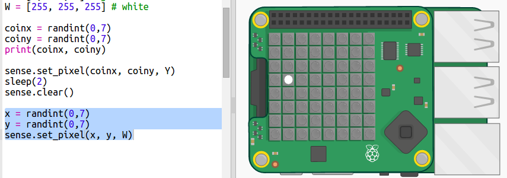
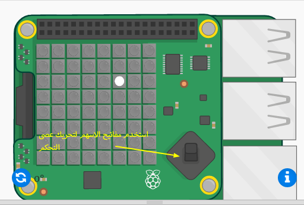
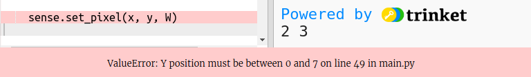
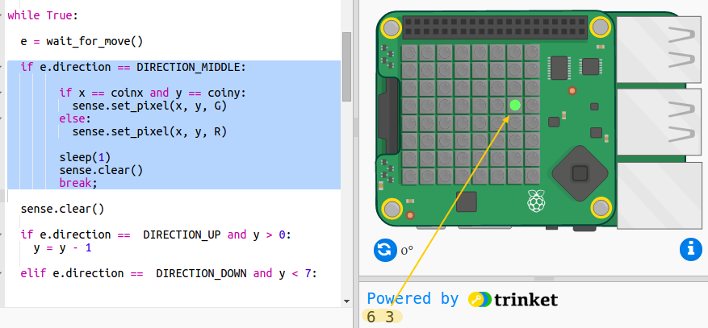

## البحث عن الكنز

الآن دعونا نعرض اللاعب كبيكسل بيضاء. ستحتاج إلى استخدام عصا تحكم Sense HAT للانتقال إلى حيث تعتقد أن الكنز مخفي.

ستجد عصا تحكم صغيرة في النسخة المادية من Sense Hat. يمكنك رؤية صورة لها في المحاكي:

في المحاكي ، يمكنك استخدام مفاتيح الأسهم لأزرار الاتجاه الموجودة على عصا التحكم ومفتاح (رجوع) للضغط على الزر الأوسط.

الآن دعنا نضيف بكسل يمكن للاعب الانتقال إليه حيث يعتقد أن الكنز مخفي. اللاعب هو بكسل أبيض.

+ الآن اعرض موقع اللاعب باستخدام بكسل أبيض:
    
    
    
    `س` و `ص` هما احداثيات اللاعب.

+ دعنا تحريك البكسل الأبيض باستخدام عصا التحكم. في كل مرة يضغط فيها اللاعب على أحد مفاتيح الأسهم على عصا التحكم ، نحتاج إلى مسح البكسل الحالي ورسم واحد في الموقع الجديد. لنبدأ بالسماح للاعب بالتحرك في اتجاه ص (لأعلى ولأسفل):
    
    

+ اختبر الكود البرمجي الخاص بك بالضغط على السهمين لأعلى ولأسفل على لوحة المفاتيح.
    
    
    
    ماذا يحدث عندما تصل إلى الحافة العلوية وتضغط لأعلى؟
    
    
    
    إذا كان الموضع "ص" أقل من 0 أو أعلى 7 ، فسوف تحصل على خطأ عند محاولة تعيين لون البكسل.

+ دعونا نضيف شيئاً للتأكد من بقاء البكسل على الشاشة:
    
    

+ الآن دعنا نضيف حركة في الاتجاه س. أضف الكود المظلل:
    
    

+ بمجرد انتقالك إلى الموقع الذي تعتقد أن الكنز مخفي، ستحتاج إلى الضغط على الزر الأوسط في عصا التحكم. في المحاكي ، ستحتاج إلى الضغط على Enter (رجوع) على لوحة المفاتيح.
    
    إذا كان اللاعب في نفس موقع الكنز ، فقد وجدوه وسيتحول لون البكسل إلى اللون الأخضر لمدة ثانية واحدة.
    
    إذا اختار اللاعب الموقع الخطأ ، فستتحول البكسل إلى اللون الأحمر لمدة ثانية واحدة.
    
    
    
    ` استراحة ` تعني أننا لسنا بحاجة إلى انتظار المزيد من الأحداث بعد أن يختار اللاعب موقعًا ، يمكننا التوقف عن تكرار الحلقة.