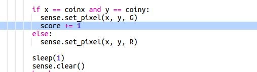

## حفظ النتيجة

في الوقت الحالي تحصل على دور واحد فقط للعثور على الكنز. دعونا نعطي اللاعب 10 ادوار والحفاظ على النتيجة.

+ ستحتاج الآن إلى ` لـ ` حلقة للسماح للاعب ب 10 ادوار للعثور على الكنز:
    
    

+ في Python ، يجب وضع مسافة بادئة للرمز ليكون داخل حلقة. لا تحتاج إلى قطع مسافة بادئة للسطر واحدًا تلو الآخر! قم بتمييز جميع الرموز بعد حلقة ` for ` ثم اضغط على "Tab" على لوحة المفاتيح وستوضع مسافة بادئة لها.
    
    
    
    تأكد من الكود البرمجي بعد ` for ` يحصل على مسافة بادئة أسفل الرمز مباشرة.

+ بعد ذلك ، أضف متغير النتيجة الذي يبدأ عند صفر:
    
    

+ ستحتاج أيضًا إلى إضافة واحد إلى النتيجة عندما يختار اللاعب الموقع الصحيح:
    
    

+ وأخيرًا ، فلنعرض النتيجة في النهاية.
    
    
    
    تأكد من عدم وجود مسافة بادئة قبل هذا الكود البرمجي، حيث يجب تشغيله بعد حلقة  for</0 > ل 10 مرات ومن ثم تنتهي اللعبة.

<ul>
<li>الآن العب اللعبة. هل يمكنك تسجيل 10 من أصل 10؟</li>
</ul></li>
</ul>