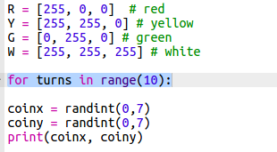
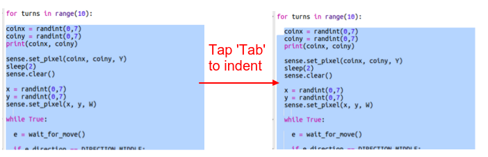
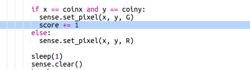
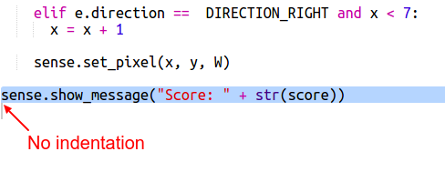

## Keeping score

At the moment you only get one go at finding the treasure. Let's give the player 10 turns and keep a score.

+ Now you'll need a `for` loop to let the player have 10 goes at finding the treasure:
    
    

+ In Python, code must be indented to be inside a loop. You don't need to indent the lines one at a time though! Highlight all of the code after the `for` loop then press the 'Tab' on the keyboard and it will all be indented.
    
    
    
    Make sure all of the code after the `for` gets indented, right to the bottom of the code.

+ Next add a score variable which starts at zero:
    
    

+ You'll also need to add one to the score when a player chooses the correct location:
    
    

+ And finally, let's display the score at the end.
    
    
    
    Make sure there's no indentation before this code, it needs to run after the `for` loop has run 10 times and the game is finished.
    
    + Now play the game. Can you score 10 out 10?