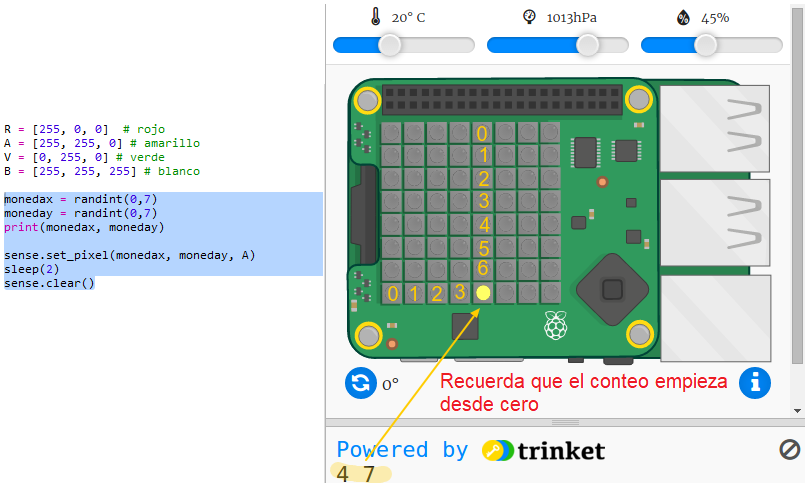

## Escondiendo el tesoro

Primero mostremos una moneda amarilla en un píxel aleatorio y luego la ocultamos.

+ Abre el Trinket de iniciación de ¿Dónde está el tesoro?: <a href="http://jumpto.cc/treasure-go" target="_blank">jumpto.cc/treasure-go</a>.

+ Echa un vistazo al código que se ha incluido para ti. This sets up the Sense HAT and the libraries you will be using, and also includes some helper code so that you can get to the interesting stuff more quickly:
    
    

+ Mostremos una moneda amarilla en una ubicación aleatoria y luego la ocultamos. Las variables `coinx` y `coiny` son las coordenadas 'x' e 'y' de la moneda. Ve a la parte inferior del script y añade el siguiente código:
    
    
    
    Asegúrate de usar una letra mayúscula `Y`.

+ Ejecuta tu código varias veces para ver como aparece y desaparece la moneda en ubicaciones aleatorias.