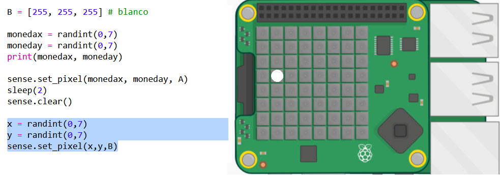
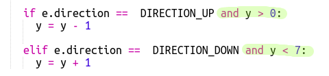

## Encontrando el tesoro

Ahora mostremos al jugador como un píxel blanco. Tendrás que usar la palanca de mando Sense HAT para navegar hacia donde creas que se encuentra escondido el tesoro.

El Sense Hat físico tiene una palanca de mando pequeña. Puedes ver una foto en el emulador:

En el emulador puedes usar las flechas del teclado como botones de dirección en la palanca de mando y el botón Enter (Retorno) para presionar el botón del centro.

Ahora agreguemos un píxel que el jugador pueda mover a donde cree que el tesoro está oculto. El jugador es un píxel blanco.

+ Ahora muestre la ubicación del jugador con un píxel blanco:
    
    
    
    `x` y `y` son las coordenadas del jugador.

+ Hagamos que el píxel blanco se mueva con la palanca de mando. Cada vez que el jugador presiona una de las flechas del teclado en la palanca de mando, necesitamos borrar el píxel actual y dibujar uno en la nueva ubicación. Comencemos permitiendo que el jugador se mueva en la dirección y (arriba y abajo):
    
    

+ Prueba tu código presionando las flechas hacia arriba y hacia abajo en el teclado.
    
    
    
    ¿Qué sucede cuando alcanzas el borde superior y presionas hacia arriba?
    
    
    
    Si la posición y es inferior a 0 o superior a 7, obtendrás un error cuando intentes configurar el color del píxel.

+ Agreguemos una marca de verificación para asegurarnos que el píxel permanezca en el monitor:
    
    

+ Ahora agreguemos movimiento en la dirección x. Añade el código resaltado:
    
    

+ Una vez que te hayas movido a la ubicación donde crees que el tesoro está oculto, debes oprimir el botón central de la palanca de mando. En el emulador deberás presionar el botón Enter (Retorno) en el teclado.
    
    Si el jugador está en la misma ubicación que el tesoro, entonces lo ha encontrado y el píxel se pone verde por 1 segundo.
    
    Si el jugador ha elegido la ubicación incorrecta, el píxel se pone rojo por 1 segundo.
    
    
    
    `break` significa que no tenemos que esperar más eventos después de que el jugador haya escogido una ubicación; podemos dejar de repetir el bucle.