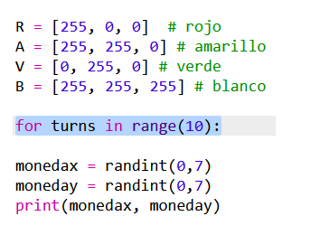
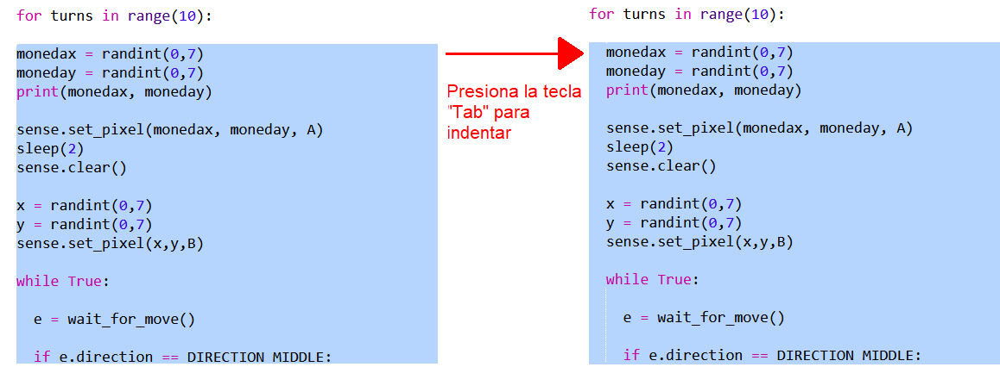
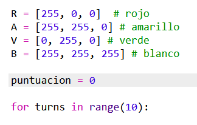
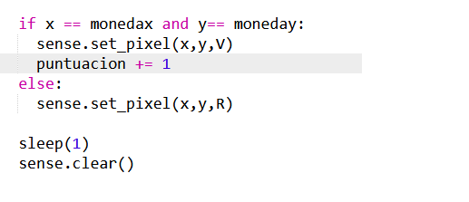
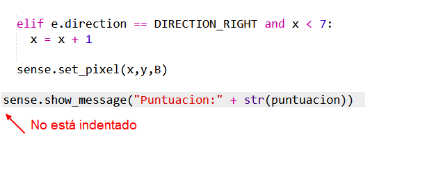

## Registrando la puntuación

Por el momento solo tienes una oportunidad para encontrar el tesoro. Vamos a darle al jugador 10 turnos y registramos la puntuación.

+ Ahora necesitarás un bucle `for` para dejar que el jugador tenga 10 intentos para encontrar el tesoro:
    
    

+ En Python, el código debe estar indentado para estar dentro de un bucle. ¡Sin embargo, no es necesario indentar las líneas de una en una! Resalta todo el código después del bucle `for` luego presione el botón 'Tab' en el teclado y todo se indentará.
    
    
    
    Asegúrate de que todo el código después de `for` se indenta, justo al final del código.

+ Luego agregue una variable de puntuación que comience en cero:
    
    

+ También deberás agregar 1 a la puntuación cuando un jugador elija la ubicación correcta:
    
    

+ Y por último, vamos a mostrar el puntaje al final.
    
    
    
    Asegúrate de que no haya indentación antes de este código. Debe ejecutarse después de que el bucle `for` se haya ejecutado 10 veces y el juego haya terminado.
    
    + Ahora juguemos. ¿Puedes conseguir una puntuación 10 de 10?