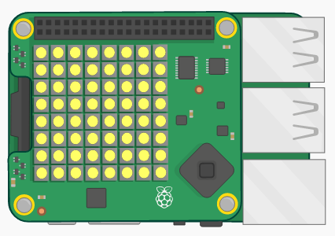

\--- challenge \---

## Desafío: Hazlo más difícil

¿Te parece que el juego es demasiado fácil? ¿Por qué no hacerlo más difícil?

Podrías mostrar la moneda por menos tiempo. `sleep(2)` muestra la moneda por 2 segundos. What about `sleep(0.5)`?

¿O qué tal confundir al jugador haciendo que todos los píxeles se vuelvan amarillos antes de que puedan elegir la ubicación? Usa `sense.clear(Y)` para llenar la pantalla con monedas amarillas después de mostrarle al jugador dónde está escondida la moneda. También necesitarás `sleep(1)` para definir por cuántos segundos quieres mostrar la pantalla amarilla.

\--- /challenge \---