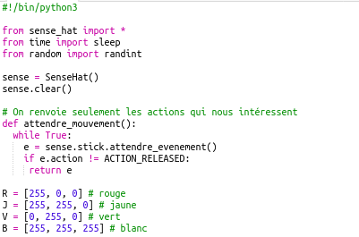
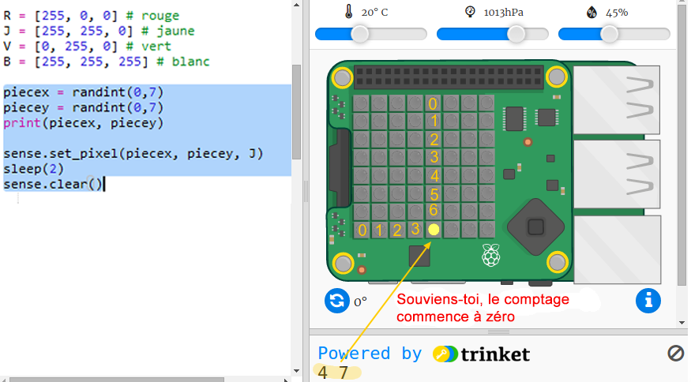

## Cacher le trésor

Nous allons d'abord montrer une pièce jaune à un pixel aléatoire et ensuite la cacher.

+ Ouvre le trinket de démarrage « Où est le trésor ? » : Trinket de démarrage : <a href="http://jumpto.cc/treasure-go" target="_blank">jumpto.cc/treasure-go</a>.

+ Jette un œil au code qui a été inclus pour toi. Ceci configure le « Sense HAT » et les bibliothèques que tu utiliseras, et inclut également du code d'aide afin que tu puisses accéder aux choses intéressantes plus rapidement :
    
    

+ Affichons une pièce jaune à un endroit aléatoire et cachons-la. Les variables `piecex` et `piecey` sont les coordonnées x et y de la pièce. Va au bas du script et ajoute le code suivant :
    
    
    
    Assure-toi d'utiliser une lettre majuscule `Y`.

+ Exécute ton code plusieurs fois pour voir la pièce apparaître et disparaître à des endroits aléatoires.