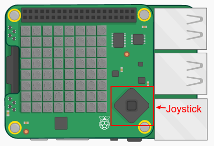
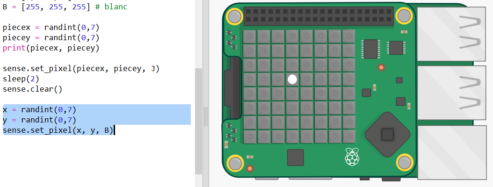
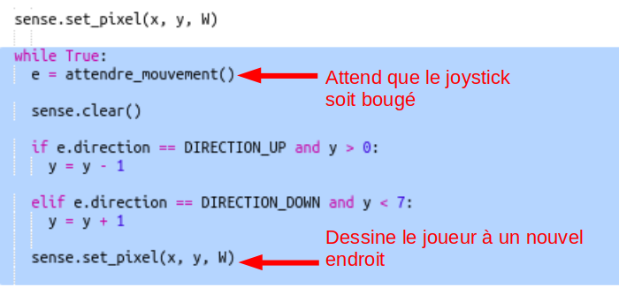
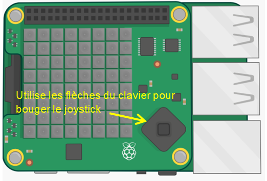
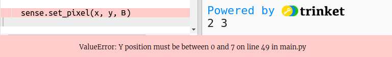
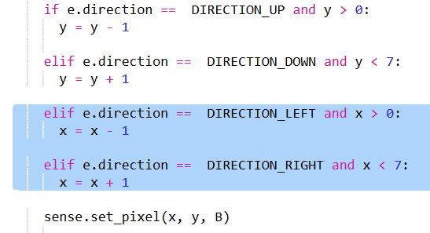
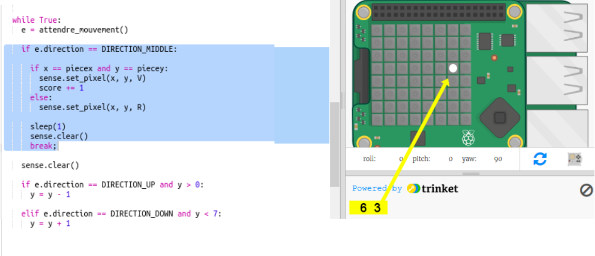

## Découvrir le trésor

Maintenant, montrons le joueur avec un pixel blanc. Tu devras utiliser le joystick du « Sense HAT » pour naviguer là où tu penses que le trésor est caché.

Le « Sense HAT » physique a un mini joystick. Tu peux en voir une image dans l'émulateur :

Dans l'émulateur, tu peux utiliser les touches fléchées pour les boutons de direction sur le joystick et Entrée (Retour) pour appuyer sur le bouton central.

Maintenant, ajoutons un pixel que le joueur peut déplacer là où il pense que le trésor est caché. Le joueur est un pixel blanc.

+ Affiche maintenant l'emplacement du joueur à l'aide d'un pixel blanc :
    
    
    
    `x` et `y` sont les coordonnées du joueur.

+ Faisons bouger le pixel blanc à l'aide du joystick. Chaque fois que le joueur appuie sur l'une des touches fléchées du joystick, nous devons effacer le pixel actuel et en dessiner un au nouvel emplacement. Commençons par permettre au joueur de se déplacer dans la direction y (haut et bas):
    
    

+ Teste ton code en appuyant sur les flèches haut et bas du clavier.
    
    
    
    Que se passe-t-il lorsque tu atteins le bord supérieur et que tu appuies sur la flèche du haut ?
    
    
    
    Si la position y descend en dessous de 0 ou au-dessus de 7, tu obtiendras une erreur lorsque tu essayeras de définir la couleur du pixel.

+ Ajoutons une vérification pour nous assurer que le pixel reste à l'écran :
    
    

+ Maintenant, ajoutons un mouvement dans la direction x. Ajoute le code en surbrillance :
    
    

+ Une fois que tu t'es déplacé à l'endroit où tu penses que le trésor est caché, tu dois appuyer sur le bouton central du joystick. Dans l'émulateur, tu devras appuyer sur Entrée (Retour) sur le clavier.
    
    Si le joueur est au même emplacement que le trésor, alors il l'a trouvé et le pixel passe au vert pendant 1 seconde.
    
    Si le joueur a choisi le mauvais emplacement, alors le pixel devient rouge pendant 1 seconde.
    
    
    
    `break` signifie que nous n'avons pas besoin d'attendre plus d'événements une fois que le joueur a choisi un emplacement, nous pouvons arrêter de répéter la boucle.