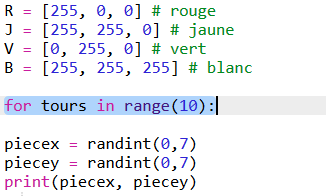
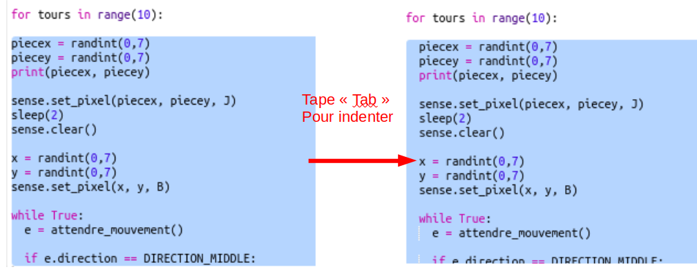
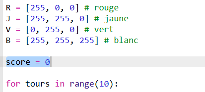
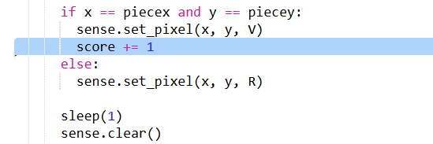
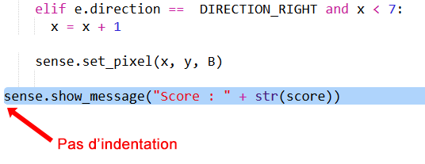

## Conserver le score

Pour le moment, tu n'as qu'un seul essai pour trouver le trésor. Donnons au joueur 10 tours et conservons un score.

+ Maintenant tu auras besoin d'une boucle `for` pour donner 10 tours au joueur pour rechercher le trésor :
    
    

+ En Python, le code doit être indenté pour être à l'intérieur d'une boucle. Mais tu n'as pas besoin d'indenter les lignes une par une! Mets en surbrillance tout le code après la boucle ` for ` puis appuies sur « Tab » sur le clavier et tout sera indenté.
    
    
    
    Assure-toi que tout le code après le `for` est indenté, jusqu'en bas du code.

+ Ajoute ensuite une variable de score qui commence à zéro :
    
    

+ Tu devras également ajouter un au score lorsqu'un joueur choisit l'emplacement correct :
    
    

+ Et enfin, affichons le score à la fin.
    
    
    
    Assure-toi qu'il n'y a pas d'indentation avant ce code, il doit s'exécuter après que la boucle `for` s'est exécutée 10 fois et que le jeu est terminé.
    
    + Maintenant joue au jeu. Peux-tu faire 10 sur 10 ?