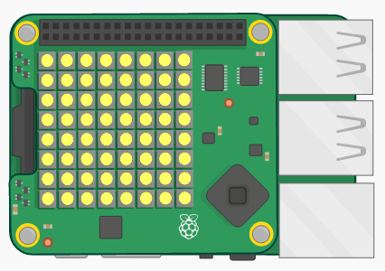

\--- challenge \---

## Défi : Rends-le plus difficile

Trouves-tu le jeu trop facile? Pourquoi ne pas le rendre plus difficile.

Tu pourrais montrer la pièce moins longtemps. `sleep(2)` montre la pièce pendant 2 secondes. Que dis-tu de `sleep(0.5)` ?

Ou alors que dirais-tu de perturber le joueur en montrant tous les pixels jaunes avant qu'il n'arrive à choisir l'emplacement? Utilise ` sense.clear (Y) ` pour remplir l'écran de pièces jaunes après avoir montré au joueur où la pièce est cachée, tu auras également besoin de `sleep(1)` ou d'un certain nombre de secondes pendant lesquelles tu souhaites afficher l'écran jaune.

\--- /challenge \---