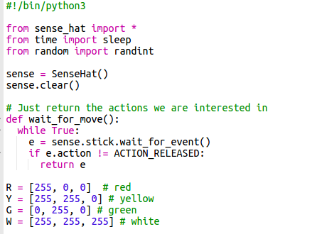
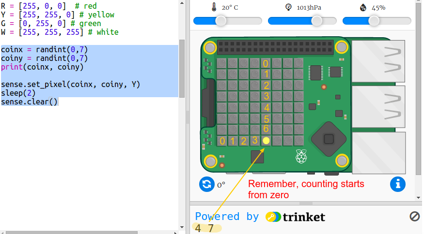

## खज़ाना छिपाना

आइए पहले हम किसी यादृच्छिक पिक्सेल पर एक पीला सिक्का दिखाएँ और फिर इसे छिपा दें।

+ खोलें खज़ाना कहाँ है? स्टार्टर Trinket: <a href="http://jumpto.cc/treasure-go" target="_blank">jumpto.cc/treasure-go</a>।

+ उस कोड को देखें जिसे आपके लिए शामिल किया गया है। यह Sense HAT और उन लाइब्रेरियों को सेट अप करता है जिनका आप उपयोग करेंगे, और इसमें कुछ सहायक कोड भी शामिल होते हैं ताकि आप दिलचस्प सामग्री को अधिक जल्दी से प्राप्त कर सकें:
    
    

+ आइए हम किसी यादृच्छिक स्थान पर एक पीला सिक्का प्रदर्शित करें और फिर इसे छिपा दें। `coinx` और `coiny` वेरिएबल सिक्के के x और y निर्देशांक हैं। स्क्रिप्ट के नीचे जाएँ और निम्न कोड जोड़ें:
    
    
    
    सुनिश्चित करें कि आप बड़े अक्षर `Y` का उपयोग करते हैं।

+ यादृच्छिक स्थानों पर सिक्का दिखाई देने और गायब होने को देखने के लिए अपना कोड कुछ बार चलाएँ।