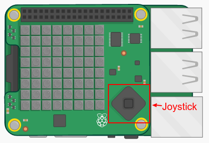

## खज़ाना ढूँढना

आइए अब हम खिलाड़ी को एक सफेद पिक्सेल के रूप में दिखाएँ। आपको जहाँ खज़ाना छिपा हुआ लगता है, वहाँ तक नेविगेट करने के लिए आपको Sense HAT जॉयस्टिक का उपयोग करना होगा।

भौतिक Sense Hat में एक मिनी जॉयस्टिक है। आप एमुलेटर में इसका चित्र देख सकते हैं:

एमुलेटर में आप जॉयस्टिक पर दिशा बटनों के लिए तीर कुंजियों का उपयोग कर सकते हैं और बीच का बटन दबाने के लिए एंटर (रिटर्न) दबा सकते हैं।

आइए अब एक पिक्सेल जोड़ते हैं जिसे खिलाड़ी उस जगह पर ले जा सकते हैं जहाँ उन्हें लगता है कि खज़ाना छिपा हुआ है। खिलाड़ी एक सफेद पिक्सेल है।

+ अब सफेद पिक्सेल का उपयोग करके खिलाड़ी के स्थान को प्रदर्शित करें:
    
    
    
    `x` और `y` खिलाड़ी के निर्देशांक हैं।

+ आइए जॉयस्टिक का उपयोग करके सफेद पिक्सेल को चलाएँ। हर बार जब खिलाड़ी जॉयस्टिक पर तीर कुंजियों में से किसी कुंजी को दबाता है तो हमें वर्तमान पिक्सेल को साफ़ करने और नए स्थान पर एक पिक्सेल बनाने की आवश्यकता होती है। आइए हम खिलाड़ी को y दिशा में (ऊपर और नीचे) चलने की अनुमति देकर आरंभ करें:
    
    

+ कीबोर्ड पर ऊपर और नीचे के तीर दबाकर अपने कोड का परीक्षण करें।
    
    
    
    जब आप ऊपर के किनारे तक पहुँच जाते हैं और ऊपर का तीर दबाते हैं तो क्या होता है?
    
    
    
    यदि y स्थिति 0 से नीचे या 7 से ऊपर चली जाती है तो पिक्सेल का रंग सेट करने का प्रयास करने पर आपको एक त्रुटि मिलेगी।

+ आइए यह सुनिश्चित करने के लिए हम एक जाँच जोड़ते हैं कि पिक्सेल डिस्प्ले पर बना रहता है:
    
    

+ आइए अब हम x दिशा में हिलना-डुलना जोड़ें। हाइलाइट किए गए कोड को जोड़ें:
    
    

+ एक बार जब आप उस स्थान पर चले जाते हैं, जहाँ आपको लगता है कि खज़ाना छिपा हुआ है, तो आपको जॉयस्टिक पर बीच का बटन दबाना होता है। एमुलेटर में आपको कीबोर्ड पर एंटर (रिटर्न) कुंजी को दबाना होगा।
    
    यदि खिलाड़ी उसी स्थान पर है जहाँ खज़ाना है, तो उन्होंने इसे पा लिया है और पिक्सेल 1 सेकंड के लिए हरा हो जाता है।
    
    यदि खिलाड़ी ने गलत स्थान चुना है, तो पिक्सेल 1 सेकंड के लिए लाल हो जाता है।
    
    
    
    `ब्रेक` मतलब है कि खिलाड़ी को एक स्थान चुनने के बाद हमें और अधिक घटनाओं की प्रतीक्षा करने की आवश्यकता नहीं है, हम लूप को दोहराना बंद कर सकते हैं।