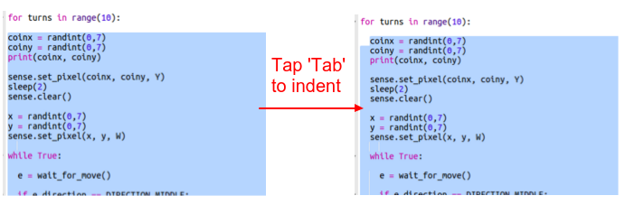
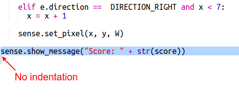

## स्कोर रखना

फिलहाल खज़ाना ढूँढने के लिए आपको केवल एक बार जाना होता है। आइए हम खिलाड़ी को 10 अवसर दें और एक स्कोर रखें।

+ अब आपको एक `for` लूप चाहिए होगा ताकि खिलाड़ी को खज़ाना खोजने के लिए 10 लूप मिलें:
    
    

+ Python में, कोड को लूप के अंदर रखने के लिए इंडेंट किया जाना चाहिए। हालांकि आपको पंक्तियों को एक बार में एक पंक्ति के अनुसार इंडेंट करने की आवश्यकता नहीं होती है! `for` लूप के बाद सभी कोड को हाइलाइट करें फिर कीबोर्ड पर 'टैब' दबाएं और यह सभी इंडेंट हो जाएगा।
    
    
    
    सुनिश्चित करें कि `for` के बाद का पूरा कोड, कोड के नीचे दाईं ओर इंडेंट हो जाता है।

+ इसके बाद एक स्कोर वेरिएबल जोड़ें जो शून्य से शुरू हो:
    
    

+ जब कोई खिलाड़ी सही स्थान चुन लेता है तो आपको स्कोर में एक भी जोड़ना होगा:
    
    

+ और अंततः, आइए अंत में हम स्कोर प्रदर्शित करें।
    
    
    
    सुनिश्चित करें कि इस कोड से पहले कोई इंडेंटेशन नहीं है, इसे `for` लूप के 10 बार चल चुकने के बाद चलना होगा और गेम समाप्त हो जाएगा।
    
    + अब गेम खेलें। क्या आप 10 में से 10 स्कोर प्राप्त कर सकते हैं?