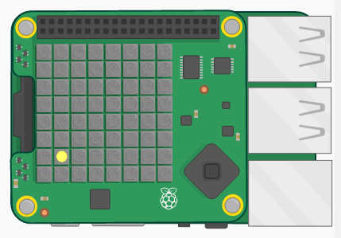

## ಪರಿಚಯ:

ಈ ಯೋಜನೆಯಲ್ಲಿ ನೀವು ನೆನಪಿನ ಆಟವನ್ನು ಆಡಲು Sense HATನಲ್ಲಿ ಜಾಯ್‌ಸ್ಟಿಕ್ ಮತ್ತು ಎಲ್ಇಡಿ ಮ್ಯಾಟ್ರಿಕ್ಸ್ ಅನ್ನು ಬಳಸುತ್ತೀರಿ. Sense HAT ಚಿನ್ನದ ನಾಣ್ಯವನ್ನು ತೋರಿಸುತ್ತದೆ ಮತ್ತು ಅದು ಎಲ್ಲಿದೆ ಎಂಬುದನ್ನು ನೀವು ನೆನಪಿಟ್ಟುಕೊಳ್ಳಬೇಕು ಮತ್ತು ಗುಪ್ತವಾದ ನಿಧಿಯನ್ನು ಕಂಡುಹಿಡಿಯಲು ಜಾಯ್‌ಸ್ಟಿಕ್ ಅನ್ನು ಬಳಸಬೇಕು.

  <iframe src="https://trinket.io/embed/python/79ac6a377d?outputOnly=true&start=result" width="600" height="500" frameborder="0" marginwidth="0" marginheight="0" allowfullscreen mark="crwd-mark">
</iframe> 

ಆಟವನ್ನು ಆಡಲು Run ಬಟನ್ನನ್ನು ಒತ್ತಿರಿ ಮತ್ತು ಹಳದಿ ಚುಕ್ಕೆ ಎಲ್ಲಿ ಕಾಣಿಸಿಕೊಳ್ಳುತ್ತದೆ ಎಂಬುದನ್ನು ಗಮನಿಸಿ - ಇದೇ ನಿಧಿ! ನಂತರ, ನಿಧಿ ಎಲ್ಲಿ ಮರೆಯಾಗಿದೆ ಎಂದು ನೀವು ಭಾವಿಸುವಿರೋ ಅಲ್ಲಿಗೆ ಕೀಲಿಮಣೆಯಲ್ಲಿರುವ ಬಾಣದ ಕೀಲಿಗಳ ( Arrow keys) ಸಹಾಯದಿಂದ ಬಿಳಿ ಚುಕ್ಕೆಯನ್ನು ಕೊಂಡೊಯ್ಯಿರಿ. ನೀವು ಅಲ್ಲಿಗೆ ಬಂದಾಗ, ರಿಟರ್ನ್ ಬಟನ್ನನ್ನು ಒತ್ತಿರಿ. ನೀವು ಸರಿಯಾಗಿದ್ದಲ್ಲಿ ಹಸಿರು ಚುಕ್ಕೆ ಮತ್ತು ತಪ್ಪಾಗಿದ್ದರೆ ಕೆಂಪು ಚುಕ್ಕೆಯನ್ನು ಕಾಣುತ್ತೀರಿ. ನೀವು 10 ಪ್ರಯತ್ನಗಳನ್ನು ಪಡೆಯುತ್ತೀರಿ ಮತ್ತು10ಕ್ಕೆ ಸ್ಕೋರ್ ಪಡೆಯುತ್ತೀರಿ.

ನೀವು Sense HAT ಎಮ್ಯುಲೇಟರ್ ಅನ್ನು ಬಳಸುವಾಗ ಜಾಯ್ ಸ್ಟಿಕ್ ಬದಲಾಗಿ ಬಾಣದ ಕೀಲಿಗಳನ್ನು (Arrow keys) ಮತ್ತು ರಿಟರ್ನ್ ಬಟನ್ನನ್ನು ಬಳಸುತ್ತೀರಿ.

### ಕ್ಲಬ್ ಮುಖಂಡರಿಗೆ ಹೆಚ್ಚುವರಿ ಮಾಹಿತಿ

ನೀವು ಈ ಯೋಜನೆಯನ್ನು ಮುದ್ರಿಸಬೇಕಾದರೆ, ದಯವಿಟ್ಟು [ಮುದ್ರಕ-ಸ್ನೇಹಿ ಆವೃತ್ತಿಯನ್ನು ಬಳಸಿ](https://projects.raspberrypi.org/kn-IN/projects/wheres-the-treasure/print) ಬಳಸಿ.

--- collapse ---
---
title: ಕ್ಲಬ್ ನಾಯಕ ಟಿಪ್ಪಣಿಗಳು
---

## ಪರಿಚಯ:

ಈ ಯೋಜನೆಯಲ್ಲಿ, ನೆನಪಿನ ಆಟವನ್ನು ರಚಿಸಲು Sense HAT ಜಾಯ್‌ಸ್ಟಿಕ್ ಅನ್ನು ಹೇಗೆ ಬಳಸಬೇಕೆಂದು ಮಕ್ಕಳು ಕಲಿಯುವರು. Sense HAT ಚಿನ್ನದ ನಾಣ್ಯವನ್ನು ತೋರಿಸುತ್ತದೆ ಮತ್ತು ಅದು ಎಲ್ಲಿದೆ ಎಂಬುದನ್ನು ನೀವು ನೆನಪಿಟ್ಟುಕೊಳ್ಳಬೇಕು ಮತ್ತು ಗುಪ್ತವಾದ ನಿಧಿಯನ್ನು ಕಂಡುಹಿಡಿಯಲು ಜಾಯ್‌ಸ್ಟಿಕ್ ಅನ್ನು ಬಳಸಬೇಕು.

## ಆನ್‌ಲೈನ್ ಸಂಪನ್ಮೂಲಗಳು

**ಈ ಯೋಜನೆಯು Python 3 ಬಳಸುತ್ತದೆ.** ನೀವು Python ಆನ್‌ಲೈನ್‌ನಲ್ಲಿ ಬರೆಯಲು [Trinket](https://trinket.io/) ಬಳಸಲು ಶಿಫಾರಸು ಮಾಡುತ್ತೇವೆ. ಈ ಯೋಜನೆಯು ಕೆಳಗಿನ Trinkets ಒಳಗೊಂಡಿದೆ:

* ['ನಿಧಿ ಎಲ್ಲಿದೆ?' Starter Trinket -- jumpto.cc/treasure-go](http://jumpto.cc/treasure-go)

ಪೂರ್ಣವಾದ ಯೋಜನೆಯನ್ನು ಒಳಗೊಂಡಿರುವ trinket ಸಹ ಇದೆ:

* ['ನಿಧಿ ಎಲ್ಲಿದೆ?' Finished -- trinket.io/python/79ac6a377d](https://trinket.io/python/79ac6a377d)

## ಆಫ್‌ಲೈನ್ ಸಂಪನ್ಮೂಲಗಳು

ಈ ಪ್ರಾಜೆಕ್ಟ್ ಅನ್ನು ಸೆನ್ಸ್ ಹ್ಯಾಟ್ (Sense HAT) ಹೊಂದಿರುವ ರಾಸ್ಪ್‌ಬೆರಿ ಪೈ (Raspberry Pi) ಕಂಪ್ಯೂಟರ್ ನಲ್ಲಿ ([ಆಫ್‌ಲೈನ್‌ನಲ್ಲಿಯೂ ಪೂರ್ಣಗೊಳಿಸಬಹುದು](https://www.codeclubprojects.org/en-GB/resources/physical-sense-hat/)). ಈ ಯೋಜನೆಗಾಗಿ 'Project Materials' ಲಿಂಕ್ ಕ್ಲಿಕ್ ಮಾಡುವ ಮೂಲಕ ನೀವು ಪ್ರಾಜೆಕ್ಟ್ ಸಂಪನ್ಮೂಲಗಳನ್ನು ಪಡೆಯಬಹುದು. ಈ ಲಿಂಕ್ 'ಪ್ರಾಜೆಕ್ಟ್ ಸಂಪನ್ಮೂಲಗಳ' ವಿಭಾಗವನ್ನು ಒಳಗೊಂಡಿದೆ, ಇದರಲ್ಲಿ ಮಕ್ಕಳು ಈ ಯೋಜನೆಯನ್ನು ಆಫ್‌ಲೈನ್‌ನಲ್ಲಿ ಪೂರ್ಣಗೊಳಿಸಲು ಬೇಕಾದ ಸಂಪನ್ಮೂಲಗಳು ಇವೆ. ಈ ಸಂಪನ್ಮೂಲಗಳ ಪ್ರತಿಕೃತಿ (Copy) ಪ್ರತಿ ಮಗುವಿಗೆ ಲಭ್ಯವಿದೆ ಎಂದು ಖಚಿತಪಡಿಸಿಕೊಳ್ಳಿ. ಈ ವಿಭಾಗವು ಕೆಳಗಿನ ಫೈಲ್‌ಗಳನ್ನು ಒಳಗೊಂಡಿದೆ:

* treasure/treasure.py

ಈ ಯೋಜನೆಯ ಪೂರ್ಣಗೊಂಡ ಆವೃತ್ತಿಯು ಸ್ವಯಂ ಸೇವಕ ಸಂಪನ್ಮೂಲಗಳ (Volunteer Resources) ವಿಭಾಗದಲ್ಲಿ ಲಭ್ಯವಿದ್ದು, ಕೆಳಗಿನ ಫೈಲ್‌ಗಳನ್ನು ಒಳಗೊಂಡಿದೆ:

* treasure-finished/treasure.py

(ಈ ಮೇಲಿನ ಎಲ್ಲಾ ಸಂಪನ್ಮೂಲಗಳನ್ನು ಯೋಜನೆ (project) ಮತ್ತು ಸ್ವಯಂ ಸೇವಕ (volunteer) `.zip` ಫೈಲ್‌ಗಳಾಗಿ ಡೌನ್‌ಲೋಡ್ ಮಾಡಬಹುದು.)

## ಕಲಿಕೆ ಉದ್ದೇಶಗಳು

* Sense HAT ಜಾಯ್‌ಸ್ಟಿಕ್;
* ಬೂಲಿಯನ್ ಲಾಜಿಕ್;

ಯೋಜನೆಯು ಈ ಕೆಳಗಿನ [Raspberry Pi Digital Making Curriculum](http://rpf.io/curriculum) ನ ಅಂಶಗಳನ್ನು ಒಳಗೊಂಡಿದೆ:

* [ಸಮಸ್ಯೆಯನ್ನು ಪರಿಹರಿಸಲು ಪ್ರೋಗ್ರಾಮಿಂಗ್ ರಚನೆಗಳನ್ನು ಸಂಯೋಜಿಸಿ.](https://www.raspberrypi.org/curriculum/programming/builder)

## ಸವಾಲುಗಳು

* ಆಟದ ನವೀಕರಣ - ವಿಭಿನ್ನ ಬಣ್ಣಗಳನ್ನು ಬಳಸಿ ಅಥವಾ ಪಠ್ಯ ಸಂದೇಶಗಳನ್ನು ಸೇರಿಸಿ. 
* ಕಠಿಣಗೊಳಿಸಿ - ಕಡಿಮೆ ಸಮಯದವರೆಗೆ ನಾಣ್ಯವನ್ನು ತೋರಿಸಿ ಅಥವಾ ಗುಪ್ತ ನಾಣ್ಯವನ್ನು ತೋರಿಸಿದ ನಂತರ ಇತರೆ ನಾಣ್ಯಗಳನ್ನು ತುಂಬಿಸುವ ಮೂಲಕ ಆಟಗಾರರನ್ನು ಗೊಂದಲಗೊಳಿಸಿ. 

--- /collapse ---

--- collapse ---
---
title: ಯೋಜನೆಯ ವಸ್ತುಗಳು
---

## ಯೋಜನೆಯ ಸಂಪನ್ಮೂಲಗಳು

* [ಎಲ್ಲಾ ಯೋಜನೆಯ ಸಂಪನ್ಮೂಲಗಳನ್ನು ಹೊಂದಿರುವ.zip ಫೈಲ್](resources/treasure-project-resources.zip)
* [Starter project](http://jumpto.cc/treasure-go)
* [ಆಫ್‌ಲೈನ್ ಸ್ಟಾರ್ಟರ್ Python ಫೈಲ್](resources/treasure-treasure.py)

## ಕ್ಲಬ್ ನಾಯಕರ ಸಂಪನ್ಮೂಲಗಳು

* [ಎಲ್ಲಾ ಪ್ರಾಜೆಕ್ಟ್ ಸಂಪನ್ಮೂಲಗಳನ್ನು ಹೊಂದಿರುವ.zip ಫೈಲ್](resources/treasure-volunteer-resources.zip)
* [ಆನ್‌ಲೈನ್ ಪೂರ್ಣಗೊಂಡ Trinket ಯೋಜನೆ](https://trinket.io/python/79ac6a377d)
* [treasure-finished/treasure.py](resources/treasure-finished-treasure.py)

--- /collapse ---