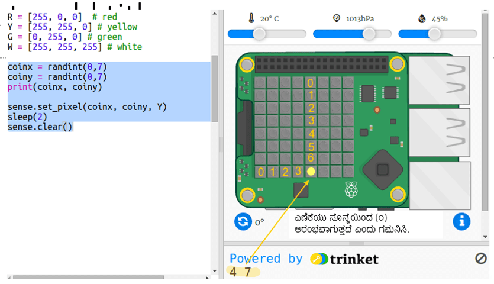

## ನಿಧಿಯನ್ನು ಮರೆಮಾಡುವುದು

ಮೊದಲು ಹಳದಿ ನಾಣ್ಯವನ್ನು ಅನಿರ್ದಿಷ್ಟ (Random) ಸ್ಥಾನದಲ್ಲಿ ತೋರಿಸಿ ನಂತರ ಅದನ್ನು ಮರೆಮಾಡಿ.

+ ನಿಧಿ ಎಲ್ಲಿದೆ? ಈ trinket ತೆರೆಯಿರಿ:<a href="http://jumpto.cc/treasure-go" target="_blank">jumpto.cc/treasure-go</a>.

+ ನಿಮಗಾಗಿ ನೀಡಿರುವ ಕೋಡ್ ಅನ್ನು ಗಮನಿಸಿ. ಇದು ಸೆನ್ಸ್ ಹ್ಯಾಟ್ ಮತ್ತು ನೀವು ಬಳಸುತ್ತಿರುವ ಲೈಬ್ರರಿಗಳನ್ನು ಹೊಂದಿಸುತ್ತದೆ, ಮತ್ತು ಕೆಲವು ಸಹಾಯಕ ಕೋಡ್ ಅನ್ನು ಸಹ ಒಳಗೊಂಡಿರುತ್ತದೆ ಇದರಿಂದ ನೀವು ಆಸಕ್ತಿದಾಯಕ ವಿಷಯವನ್ನು ತ್ವರಿತವಾಗಿ ಪಡೆಯಬಹುದು:
    
    

+ ಹಳದಿ ನಾಣ್ಯವನ್ನು ಅನಿರ್ದಿಷ್ಟ (Random) ಸ್ಥಾನದಲ್ಲಿ ತೋರಿಸಿ ನಂತರ ಅದನ್ನು ಮರೆಮಾಡೋಣ. `coinx` ಮತ್ತು `coiny` ಅಸ್ಥಿರಗಳು (Variables) ನಾಣ್ಯದ x ಮತ್ತು y ನಿರ್ದೇಶಾಂಕಗಳಾಗಿವೆ. ನಿಮ್ಮ ಫೈಲ್‌ನ ಕೆಳಭಾಗಕ್ಕೆ ಹೋಗಿ ಮತ್ತು ಈ ಕೆಳಗಿನ ಕೋಡ್ ಅನ್ನು ಸೇರಿಸಿ:
    
    
    
    ನೀವು ದೊಡ್ಡ ಅಕ್ಷರ `Y` ಅನ್ನು ಬಳಸುತ್ತಿದ್ದೀರಿ ಎಂಬುದನ್ನು ಖಚಿತಪಡಿಸಿಕೊಳ್ಳಿ.

+ ನಾಣ್ಯವು ಅನಿರ್ದಿಷ್ಟ ಸ್ಥಾನದಲ್ಲಿ ಗೋಚರಿಸುವುದನ್ನು ಮತ್ತು ಕಣ್ಮರೆಯಾಗುವುದನ್ನು ನೋಡಲು ನಿಮ್ಮ ಕೋಡ್ ಅನ್ನು ಕೆಲವು ಬಾರಿ ಚಲಾಯಿಸಿ (Run).