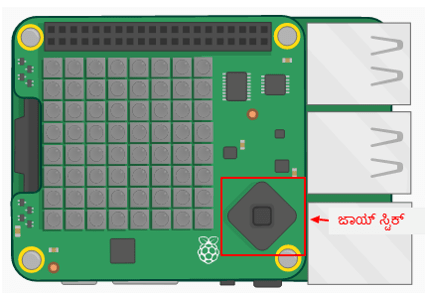
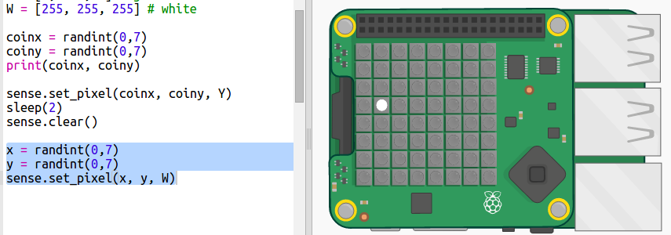
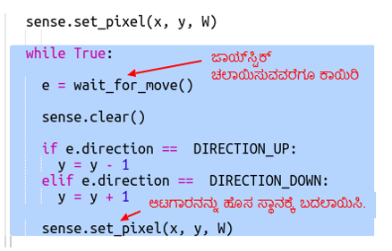
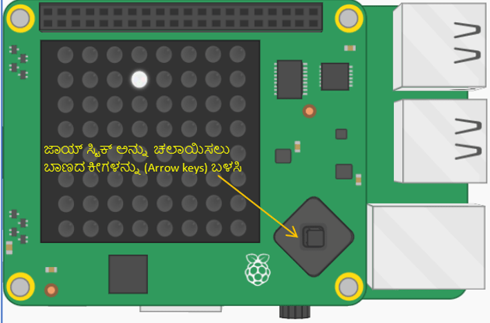
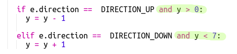
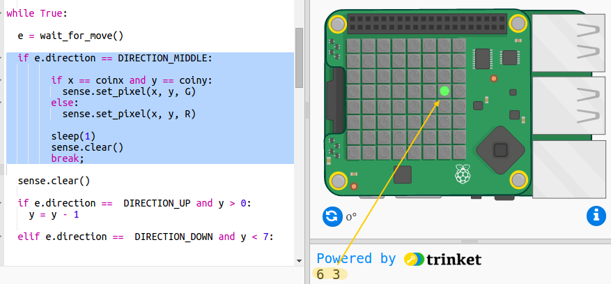

## ನಿಧಿಯನ್ನು ಹುಡುಕುವುದು

ಈಗ ಆಟಗಾರನನ್ನು ಬಿಳಿ ಪಿಕ್ಸೆಲ್‌ನಂತೆ ತೋರಿಸೋಣ. ನಿಧಿ ಎಲ್ಲಿ ಮರೆಯಾಗಿದೆ ಎಂದು ನೀವು ಭಾವಿಸುವಿರೋ ಆ ಸ್ಥಳ್ಳಕ್ಕೆ ತಲುಪಲು Sense HAT ಜಾಯ್ ಸ್ಟೆಕ್ ಅನ್ನು ಬಳಸಿ.

ಭೌತಿಕ Sense HAT ಮಿನಿ ಜಾಯ್‌ಸ್ಟಿಕ್ ಅನ್ನು ಹೊಂದಿದೆ. ಎಮ್ಯುಲೇಟರ್ನಲ್ಲಿ ನೀವು ಅದರ ಚಿತ್ರವನ್ನು ನೋಡಬಹುದು:

ಎಮ್ಯುಲೇಟರ್‌ನಲ್ಲಿ ನೀವು ಜಾಯ್‌ಸ್ಟಿಕ್‌ನ ದಿಕ್ಕಿನ ಬಟನ್ ಗಳಿಗಾಗಿ ಬಾಣದ ಕೀಲಿಗಳನ್ನು(Arrow keys) ಮತ್ತು ಮಧ್ಯದ ಬಟನ್ನನ್ನು ಒತ್ತುವುದಕ್ಕಾಗಿ ಎಂಟರ್ (ಹಿಂತಿರುಗಿ) ಕೀಯನ್ನು ಬಳಸಬಹುದು.

ಈಗ ಆಟಗಾರನು ನಿಧಿಯನ್ನು ಮರೆಮಾಡಲಾಗಿದೆ ಎಂದು ಭಾವಿಸುವ ಸ್ಥಳಕ್ಕೆ ಹೋಗಬಹುದಾದ ಪಿಕ್ಸೆಲ್ ಅನ್ನು ಸೇರಿಸೋಣ. ಆಟಗಾರನು ಬಿಳಿ ಪಿಕ್ಸೆಲ್ ಆಗಿದ್ದಾನೆ.

+ ಈಗ ಬಿಳಿ ಪಿಕ್ಸೆಲ್ ಬಳಸಿ ಆಟಗಾರನ ಸ್ಥಳವನ್ನು ಸೂಚಿಸಿ:
    
    
    
    ` x ` ಮತ್ತು ` y ` ಆಟಗಾರರ ನಿರ್ದೇಶಾಂಕಗಳಾಗಿವೆ.

+ ಜಾಯ್‌ಸ್ಟಿಕ್ ಬಳಸಿ ಬಿಳಿ ಪಿಕ್ಸೆಲ್ ಚಲಿಸುವಂತೆ ಮಾಡೋಣ. ಪ್ರತಿ ಬಾರಿಯೂ ಆಟಗಾರನು ಜಾಯ್‌ಸ್ಟಿಕ್‌ನಲ್ಲಿರುವ ಬಾಣದ ಕೀಲಿಗಳಲ್ಲಿ (Arrow keys) ಒಂದನ್ನು ಒತ್ತಿದಾಗ ನಾವು ಪ್ರಸ್ತುತ ಪಿಕ್ಸೆಲ್ ಅನ್ನು ತೆರವುಗೊಳಿಸಬೇಕು ಮತ್ತು ಹೊಸ ಸ್ಥಳದಲ್ಲಿ ಒಂದನ್ನು ಸೇರಿಸಬೇಕು. ಆಟಗಾರನು y ದಿಕ್ಕಿನಲ್ಲಿ ಚಲಿಸಲು ಅನುಮತಿಸುವ ಮೂಲಕ ಪ್ರಾರಂಭಿಸೋಣ (ಮೇಲಕ್ಕೆ ಮತ್ತು ಕೆಳಕ್ಕೆ):
    
    

+ ಕೀಬೋರ್ಡ್‌ನಲ್ಲಿ ಮೇಲಿನ ಮತ್ತು ಕೆಳಗಿನ ಬಾಣಗಳನ್ನು (Arrow keys) ಒತ್ತುವ ಮೂಲಕ ನಿಮ್ಮ ಕೋಡ್ ಅನ್ನು ಪರೀಕ್ಷಿಸಿ.
    
    
    
    ನೀವು ಮೇಲಿನ ತುದಿಯನ್ನು ತಲುಪಿ ಮತ್ತೆ ಮೇಲಿನ ಬಾಣದ ಕೀಯನ್ನು ( Up Arrow key) ಒತ್ತಿದಾಗ ಏನಾಗುತ್ತದೆ?
    
    
    
    Y ಸ್ಥಾನವು 0 ಕ್ಕಿಂತ ಕಡಿಮೆ ಅಥವಾ 7 ಕ್ಕಿಂತ ಹೆಚ್ಚಿದ್ದರೆ ನೀವು ದೋಷವನ್ನು ಪಡೆಯುತ್ತೀರಿ ಮತ್ತು ಪಿಕ್ಸೆಲ್ ಬಣ್ಣವನ್ನು ಹೊಂದಿಸಿ.

+ ಪಿಕ್ಸೆಲ್ ಪರದೆ (Screen) ಮೇಲೆ ಉಳಿಯುತ್ತದೆ ಎಂದು ಖಚಿತಪಡಿಸಿಕೊಳ್ಳಲು ಚೆಕ್ ಅನ್ನು ಸೇರಿಸೋಣ:
    
    

+ ಈಗ x ದಿಕ್ಕಿನಲ್ಲಿ ಚಲನೆಯನ್ನು ಸೇರಿಸೋಣ. ಹೈಲೈಟ್(highlight) ಮಾಡಿದ ಕೋಡ್ ಸೇರಿಸಿ:
    
    

+ ನಿಧಿಯನ್ನು ಮರೆಮಾಡಲಾಗಿದೆ ಎಂದು ನೀವು ಭಾವಿಸುವ ಸ್ಥಳಕ್ಕೆ ತಲುಪಿದ ನಂತರ ಜಾಯ್‌ಸ್ಟಿಕ್‌ನ ಮಧ್ಯದ ಬಟನ್ನನ್ನು ಒತ್ತಿ. ಎಮ್ಯುಲೇಟರ್ನಲ್ಲಿ ನೀವು ಕೀಬೋರ್ಡ್ ನ Enter (Return) ಬಟನ್ನನ್ನು ಒತ್ತಬೇಕು.
    
    ಆಟಗಾರನು ನಿಧಿಯಿದ್ದ ಸ್ಥಾನದಲ್ಲಿಯೇ ಇದ್ದರೆ ಅವರು ಅದನ್ನು ಕಂಡುಹಿಡಿದಿದ್ದಾರೆ ಮತ್ತು ಪಿಕ್ಸೆಲ್ 1 ಸೆಕೆಂಡಿಗೆ ಹಸಿರು ಬಣ್ಣಕ್ಕೆ ಹೋಗುತ್ತದೆ.
    
    ಆಟಗಾರನು ತಪ್ಪಾದ ಸ್ಥಳವನ್ನು ಆರಿಸಿದ್ದರೆ ಪಿಕ್ಸೆಲ್ 1 ಸೆಕೆಂಡಿಗೆ ಕೆಂಪು ಬಣ್ಣಕ್ಕೆ ಹೋಗುತ್ತದೆ.
    
    
    
    `break` ಅಂದರೆ ಆಟಗಾರನು ಸ್ಥಳವನ್ನು ಆಯ್ಕೆ ಮಾಡಿದ ನಂತರ ನಾವು ಹೆಚ್ಚಿನ ಘಟನೆಗಳಿಗಾಗಿ (events) ಕಾಯಬೇಕಾಗಿಲ್ಲ, ನಾವು ಲೂಪ್ ಅನ್ನು ಪುನರಾವರ್ತಿಸುವುದನ್ನು ನಿಲ್ಲಿಸಬಹುದು.