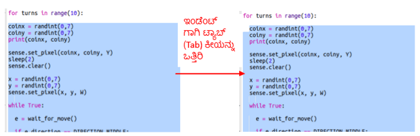

## ಸ್ಕೋರ್ ಇಟ್ಟುಕೊಳ್ಳುವುದು

ಈ ಸಮಯದಲ್ಲಿ ನೀವು ನಿಧಿಯನ್ನು ಹುಡುಕುವಲ್ಲಿ ಒಂದು ಬಾರಿ ಮಾತ್ರ ಹೋಗುತ್ತೀರಿ. ಆಟಗಾರನಿಗೆ 10 ಅವಕಾಶಗಳನ್ನು ನೀಡೋಣ ಮತ್ತು ಸ್ಕೋರ್ ಇಟ್ಟುಕೊಳ್ಳೋಣ.

+ ಈಗ ಆಟಗಾರನಿಗೆ 10 ಅವಕಾಶಗಳನ್ನು ಒದಗಿಸಿಕೊಡಲು ನಿಮಗೆ ಫಾರ್(`for`) ಲೂಪ್ ನ ಅಗತ್ಯವಿದೆ:
    
    

+ ಪೈಥಾನ್‌ನಲ್ಲಿ, ಕೋಡ್ ಅನ್ನು ಲೂಪ್ ಒಳಗೆ ಇರಿಸಲು ಇಂಡೆಂಟ್ ಮಾಡಬೇಕು. ನೀವು ಒಂದೇ ಸಮಯದಲ್ಲಿ ಸಾಲುಗಳನ್ನು ಇಂಡೆಂಟ್ ಮಾಡುವ ಅಗತ್ಯವಿಲ್ಲ! ಫಾರ್(`for`) ಲೂಪ್ ನಂತರದ ಎಲ್ಲಾ ಕೋಡ್ ಗಳನ್ನು ಹೈಲೈಟ್ ಮಾಡಿ ಕೀಬೋರ್ಡ್ ನ ಟ್ಯಾಬ್ ಕೀಯನ್ನು ಒತ್ತಿರಿ ಮತ್ತು ಈ ಪ್ರಕ್ರಿಯೆ ಕೋಡ್ ಗಳನ್ನು ಇಂಡೆಂಟ್ ಮಾಡುತ್ತದೆ.
    
    
    
    ಫಾರ್(`for`) ಲೂಪ್ ನಂತರದ ಎಲ್ಲಾ ಕೋಡ್ ಗಳು ಕೆಳಭಾಗದ ಬಲಕ್ಕೆ ಇಂಡೆಂಟ್ ಆಗಿರುವುದನ್ನು ಖಚಿತಪಡಿಸಿಕೊಳ್ಳಿ.

+ ಮುಂದೆ ಶೂನ್ಯದಿಂದ (0) ಪ್ರಾರಂಭವಾಗುವ ಸ್ಕೋರ್ (score) ಅಸ್ಥಿರವನ್ನು (Variable) ಸೇರಿಸಿ:
    
    

+ ಆಟಗಾರನು ಸರಿಯಾದ ಸ್ಥಳವನ್ನು ಆರಿಸಿದಾಗ ನೀವು ಸ್ಕೋರ್‌ಗೆ ಒಂದನ್ನು ಸೇರಿಸುವ ಅಗತ್ಯವಿದೆ:
    
    

+ ಮತ್ತು ಅಂತಿಮವಾಗಿ, ಕೊನೆಯಲ್ಲಿ ಸ್ಕೋರ್ ಅನ್ನು ಪ್ರದರ್ಶಿಸೋಣ.
    
    
    
    ಈ ಕೋಡ್ ಗೆ ಮೊದಲು ಯಾವುದೇ ಇಂಡೆಂಟೇಶನ್ ಇಲ್ಲ ಎಂಬುದನ್ನು ಖಚಿತಪಡಿಸಿಕೊಳ್ಳಿ, ಈ ಕೋಡ್ ಫಾರ್(`for`) ಲೂಪ್ 10 ಬಾರಿ ರನ್ ಆದ ನಂತರ ರನ್ ಆಗಬೇಕು ಮತ್ತು ಇಲ್ಲಿಗೆ ಆಟ ಮುಗಿದಿದೆ ಎಂದರ್ಥ.
    
    + ಈಗ ಆಟವಾಡಿ. ನೀವು 10 ರಲ್ಲಿ 10 ಸ್ಕೋರ್ ಮಾಡಬಹುದೇ?