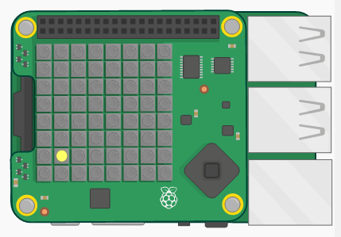

## 소개

In this project you will use the joystick and LED Matrix on the Sense HAT to play a memory game. The Sense HAT will show a gold coin and you have to remember where it was and use the joystick to find the hidden treasure.

  <iframe src="https://trinket.io/embed/python/79ac6a377d?outputOnly=true&start=result" width="600" height="500" frameborder="0" marginwidth="0" marginheight="0" allowfullscreen mark="crwd-mark">
</iframe> 

To play the game press Run and watch to see where the yellow dot appears - this is the treasure! Then use the arrow keys on the keyboard to move the white dot to where you think the treasure is hidden. When you get there, press return. You'll see a green dot if you were correct and a red dot if you got it wrong. You'll get 10 tries and then a score out of 10.

Note that when you are using the Sense HAT emulator you use the arrow keys and return instead of the joystick on the Sense HAT.

### 교육자들을 위한 추가 정보

이 프로젝트를 인쇄하려면 [프린트용 문서](https://projects.raspberrypi.org/en/projects/wheres-the-treasure/print)를 사용하십시오.

## \--- collapse \---

## 제목: 교육자 노트

## 소개

In this project, children will learn how to use the Sense HAT joystick to create a memory game. The Sense HAT shows a gold coin and you have to remember where it was and use the joystick to find the hidden treasure.

## 온라인 자료들

**This project uses Python 3.** We recommend using [Trinket](https://trinket.io/) to write Python online. 이 프로젝트에 포함된 Trinket은 다음과 같습니다:

* ['Where's the Treasure?' Starter Trinket -- jumpto.cc/treasure-go](http://jumpto.cc/treasure-go)

완성된 프로젝트가 저장된 Trinket도 있습니다:

* [‘Where's the Treasure’ Finished -- trinket.io/python/79ac6a377d](https://trinket.io/python/79ac6a377d)

## 오프라인 자료들

This project can also be [completed offline](https://www.codeclubprojects.org/en-GB/resources/physical-sense-hat/) on a Raspberry Pi computer with a Sense HAT. 'Project Materials' 라는 링크를 클릭하여 이 프로젝트의 자료를 확인해볼 수 있습니다. 이 링크에는 학생들이 프로젝트를 오프라인으로 완료하는 데 필요한 자료가 포함된 'Project Resource' 섹션이 있습니다. 학생들이 이러한 자료의 사본에 접근할 수 있는지 확인하십시오. 이 섹션에는 아래와 같은 파일들이 포함되어 있습니다.

* treasure/treasure.py

이 프로젝트의 완성된 버전은 'Volunteer Resources' 섹션에서 찾을 수 있습니다.

* treasure-finished/treasure.py

(또한 위의 모든 자료는 프로젝트 및 자원봉사자 `.zip` 파일로 다운로드 할 수 있습니다.)

## 학습 목표

* Sense HAT joystick;
* Boolean logic;

이 프로젝트는 [라즈베리파이 디지털 메이킹 커리큘럼](http://rpf.io/curriculum) 중 아래의 과정에 있는 요소들을 다룹니다.

* [프로그래밍 구조를 결합하여 문제 해결하기](https://www.raspberrypi.org/curriculum/programming/builder)

## 도전과제

* Customize the game - use different colours or add text messages. 
* Make it harder - show the coin for less time or confuse players by filling the display with coins after showing the hidden coin. 

\--- /collapse \---

## \--- collapse \---

## title: 프로젝트 자료

## 프로젝트 리소스

* [프로젝트의 모든 리소스가 들어있는 .zip 파일](resources/treasure-project-resources.zip)
* [Starter project](http://jumpto.cc/treasure-go)
* [Offline starter Python file](resources/treasure-treasure.py)

## 교육자를 위한 자료

* [완성된 모든 프로젝트 리소스가 들어있는 .zip 파일](resources/treasure-volunteer-resources.zip)
* [완성된 온라인 Trinket 프로젝트](https://trinket.io/python/79ac6a377d)
* [treasure-finished/treasure.py](resources/treasure-finished-treasure.py)

\--- /collapse \---