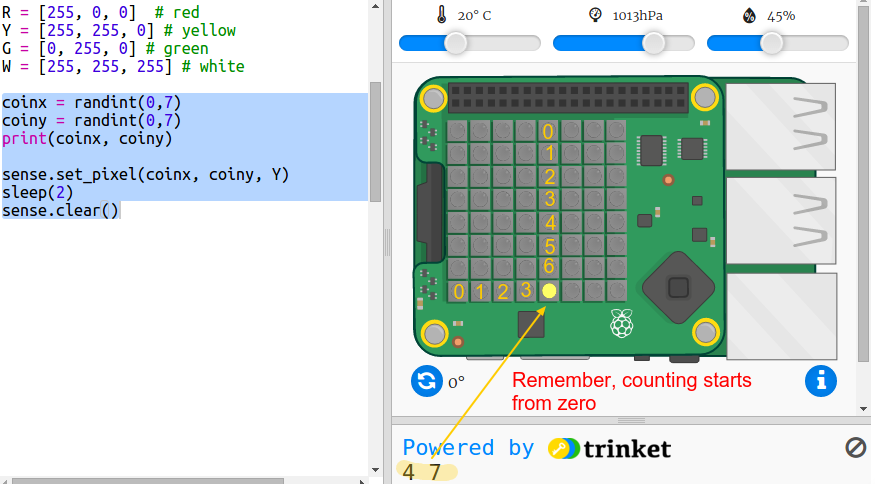

## Hiding the treasure

First let's show a yellow coin at a random pixel and then hide it.

+ Open the Where's the Treasure? Starter Trinket: <a href="http://jumpto.cc/treasure-go" target="_blank">jumpto.cc/treasure-go</a>.

+ Take a look at the code that has been included for you. This sets up the Sense HAT and the libraries you will be using, and also includes some helper code so that you can get to the interesting stuff more quickly:
    
    

+ Let's display a yellow coin at a random location and then hide it. The `coinx` and `coiny` variables are the x and y coordinates of the coin. Go to the bottom of the script and add the following code:
    
    
    
    Make sure you use a capital letter `Y`.

+ Run your code a few times to see the coin appear and disappear at random locations.