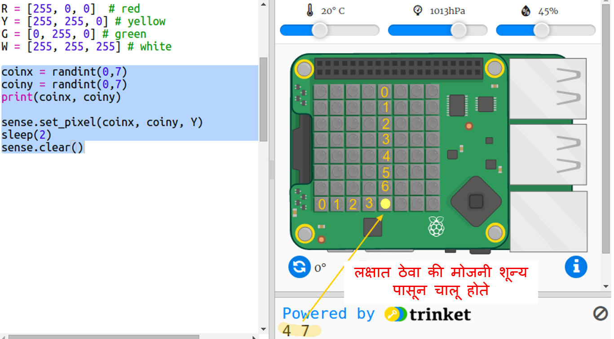

## खजिना लपवा

प्रथम रेंडम पिक्सेलवर पिवळा नाणे दर्शवू आणि मग ते लपवू.

+ खजिना कोठे आहे ते उघडा? Starter Trinket: <a href="http://jumpto.cc/treasure-go" target="_blank">jumpto.cc/treasure-go</a>.

+ आपल्यासाठी समाविष्ट केलेला कोड पहा. हे आपण वापरत असलेल्या Sense HAT आणि लायब्ररी सेट करते आणि यामध्ये काही मदतनीस कोड देखील समाविष्ट करते जेणेकरून आपणास स्वारस्यपूर्ण गोष्टी अधिक द्रुतपणे मिळू शकतील:
    
    

+ रेंडम ठिकाणी पिवळा नाणे प्रदर्शित करू आणि मग तो लपवू. `coinx` and `coiny` व्हेरीएबल्स हे नाण्याच्या x आणि y समन्वय आहेत. आपल्या स्क्रीप्टच्या तळाशी जा आणि खालील कोड जोडा:
    
    
    
    आपण मोठे अक्षर `Y` वापरल्याची खात्री करा.

+ नाणी काही वेळा दिसण्यासाठी आणि रेंडम ठिकाणी अदृश्य होण्यासाठी आपला कोड काही वेळा run करा.