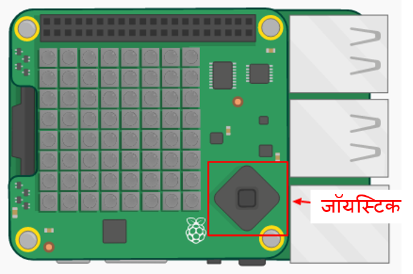
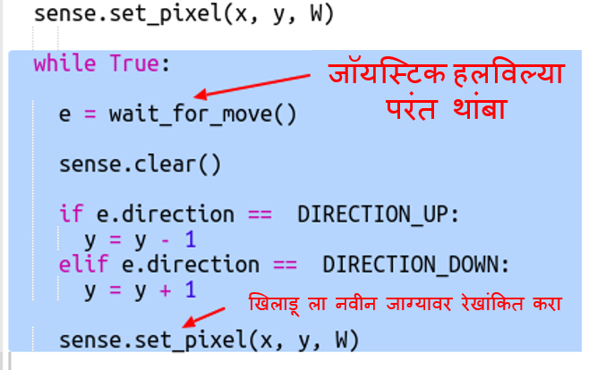
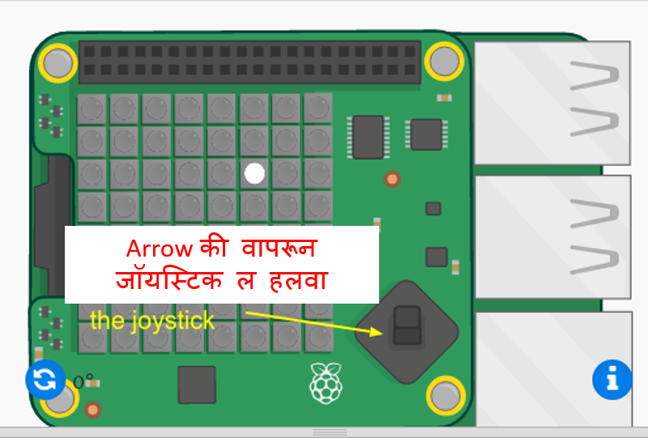
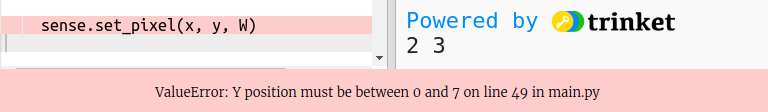

## खजिना शोधा

आता खेडाळूला पांढरा पिक्सेल म्हणून दाखवू. हा खजिना लपविला आहे असे वाटेल तेथे नेव्हिगेट करण्यासाठी आपल्याला Sense HATजॉयस्टिक वापरण्याची आवश्यकता आहे.

फिजिकल Sense Hatची मिनी जॉयस्टिक आहे. आपण त्याचे चित्र एमुलेटरमध्ये पाहू शकता:

एमुलेटर मध्ये आपण जॉयस्टिकच्या दिशानिर्देश बटणांसाठी एरो की वापरू शकता आणि मध्य बटण दाबण्यासाठी एंटर (रिटर्न) वापरू शकता.

चला आता खजिना लपविलेला असेल तेथे खेडाळू हलवू शकेल असा एक पिक्सेल जोडू. खेळाडू एक पांढरा पिक्सेल आहे.

+ आता पांढरा पिक्सेल वापरुन खेडाळूचे स्थान प्रदर्शित करा:
    
    
    
    ` x ` आणि ` y ` खेळाडूचे समन्वयक आहेत.

+ जॉयस्टिकच्या सहाय्याने पांढरा पिक्सेल हलवू या. प्रत्येक वेळी जेव्हा खेडाडू जॉयस्टिकवरील एक एरो दाबेल तेव्हा आपण वर्तमान पिक्सेल साफ करणे आवश्यक आहे आणि नवीन स्थानावर एक रेखांकित करणे आवश्यक आहे. चला खेडाळूमा y दिशेने (वर आणि खाली) जाण्याची परवानगी देऊन प्रारंभ करूया:
    
    

+ कीबोर्ड वरील अप आणि डाउन एरो दाबून आपल्या कोडची चाचणी घ्या.
    
    
    
    जेव्हा आपण वरच्या काठावर पोहोचता आणि वर अप दाबाल तेव्हा काय होते?
    
    
    
    जर y स्थिती (पोसीशन) 0 किंवा 7 च्या वर गेली तर आपण पिक्सेलचा रंग वापरुन सेट केल्यावर आपल्याला त्रुटी येईल.

+ डिस्प्लेवर पिक्सेल राहील याची खात्री करण्यासाठी चेक जोडू:
    
    

+ आता x दिशेने म्हूवमेंट जोडू. हायलाइट केलेला कोड जोडा:
    
    

+ एकदा आपण ज्या स्थानावर हा खजिना लपविला गेला आहे असे स्थानी पहोचल्यावर जॉयस्टिक वर मीडल बटण दाबावे लागेल. एमुलेटर मध्ये आपल्याला कीबोर्डवरील एंटर (रिटर्न) दाबावे लागेल.
    
    जर खेळाडू खजिन्याच्याच स्थानावर असेल तर त्यांना ते सापडले आहे आणि पिक्सेल 1 सेकंदासाठी हिरवा होईल.
    
    जर खेळाडूने चुकीचे स्थान निवडले असेल तर पिक्सेल 1 सेकंदासाठी लाल होईल.
    
    
    
    ` ब्रेक ` याचा अर्थ असा की खेळाडूने स्थान निवडल्यानंतर आम्हाला अधिक एव्हेंट्सची प्रतीक्षा करण्याची आवश्यकता नाही, आम्ही लूपची पुनरावृत्ती थांबवू शकतो.