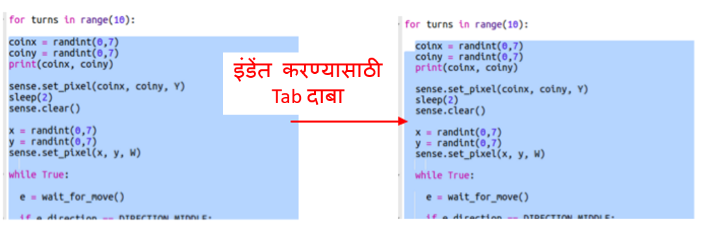
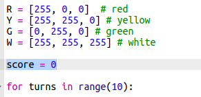
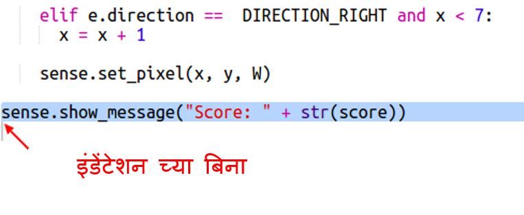

## गुणांची नोंद

या क्षणी आपल्याला खजिना शोधन्या साठी फक्त एक संधी शोधण्यात मिळेल. चला खेडाळूला 10 वळणे देवू आणि गुण नोंदूया.

+ आता खेळाडूला खजिना शोधण्या साठी 10 वेळा देण्या साठी `for` लूप ची आवश्यक्ता असेल:
    
    

+ Python कोड, लूपमध्ये असणे आवश्यक आहे. आपल्याला एकाच वेळी एकदा रेषा इंडेंट करण्याची आवश्यकता नाही! `for` लूप नंतर सर्व कोड हाइलाइट करून नंतर कीबोर्डवरील 'टॅब' दाबा आणि हे सर्व इंडेंट केले जाईल.
    
    
    
    `for` नंतर चे सर्व कोड खाली तळाशी इंडेंट होत असल्याचे सुनिश्चित करा.

+ पुढे शून्यपासून सुरू होणारा स्कोअर व्हेरिएबल जोडा:
    
    

+ जेव्हा एखादा खेळाडू योग्य स्थान निवडतो तेव्हा आपल्याला स्कोअरमध्ये एक जोडणे देखील आवश्यक असेल:
    
    

+ आणि शेवटी, शेवटचा स्कोअर प्रदर्शित करू.
    
    
    
    या कोडच्या आधी कोणताही इंडेंटेशन नसल्याचे सुनिश्चित करा, यासाठी `for` लूप 10 वेळा चालला आहे आणि गेम समाप्त झाला आहे.
    
    + आता खेळ खेळा. आपण 10 पैकी 10 गुण मिळवू शकता?