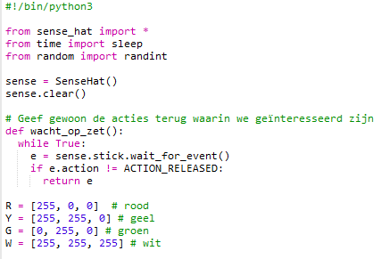
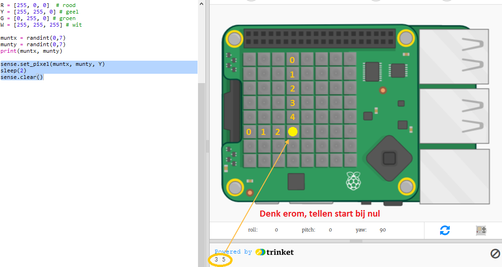

## De schat verbergen

Laten we eerst een gele munt op een willekeurige pixel tonen en deze vervolgens verbergen.

+ Open de Waar is de schat? start Trinket: <a href="https://trinket.io/python/e0e7307191" target="_blank">trinket.io/python/e0e7307191</a>.

+ Kijk eens naar de code die voor jou is opgenomen. Dit stelt de Sense HAT en de bibliotheken die je gaat gebruiken in, en bevat ook wat hulpcode zodat je sneller bij de interessante dingen kunt komen:
    
    

+ Laten we een gele munt op een willekeurige locatie tonen en deze vervolgens verbergen. De `muntx` en `munty` variabelen zijn de x en y coördinaten van de munt. Ga naar de onderkant van het script en voeg de volgende code toe:
    
    
    
    Zorg ervoor dat je een hoofdletter `Y` gebruikt.

+ Voer je code een paar keer uit om de munt te zien verschijnen en verdwijnen op willekeurige locaties.