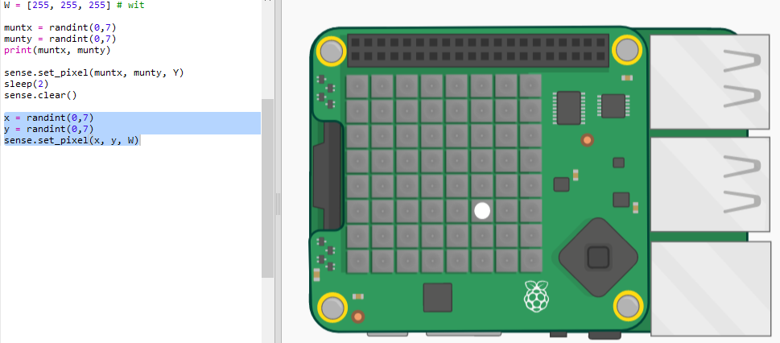
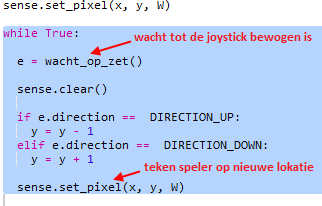
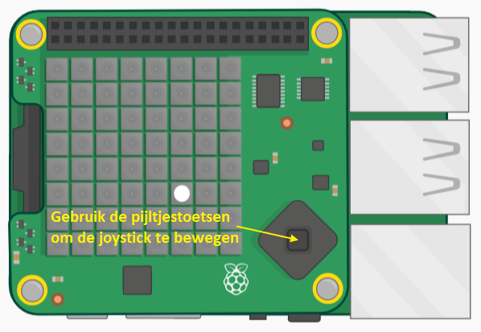
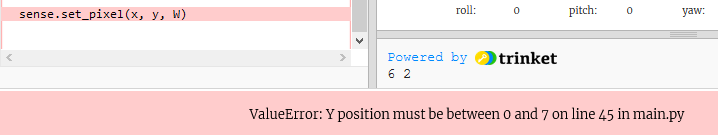
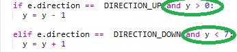
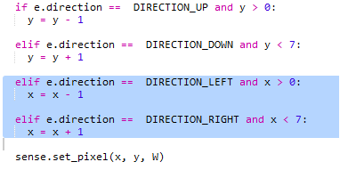
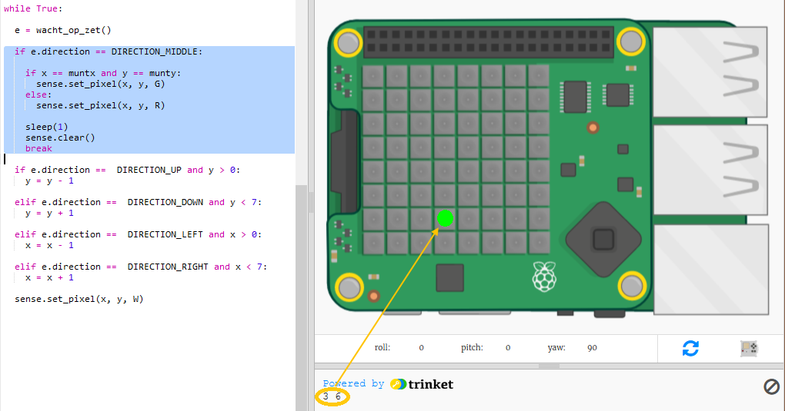

## De schat vinden

Laten we nu de speler tonen als een witte pixel. Je moet de Sense HAT-joystick gebruiken om te navigeren naar waar je denkt dat de schat verborgen is.

De fysieke Sense HAT heeft een mini-joystick. Je kunt er een plaatje van zien in de emulator:

In de emulator kun je de pijltjestoetsen gebruiken voor de richting knoppen op de joystick en Enter (Return) voor het indrukken van de middelste knop.

Laten we nu een pixel toevoegen die de speler kan verplaatsen naar waar hij denkt dat de schat verborgen is. De speler is een witte pixel.

+ Toon nu de locatie van de speler met een witte pixel:
    
    
    
    `x` en `y` zijn de coördinaten van de speler.

+ Laten we de witte pixel bewegen met de joystick. Elke keer als de speler op een van de pijltjestoetsen op de joystick drukt, moeten we de huidige pixel wissen en er een op de nieuwe locatie tekenen. Laten we beginnen met de speler in de y-richting te laten bewegen (naar boven en omlaag):
    
    

+ Test je code door op de pijltoetsen omhoog en omlaag op het toetsenbord te drukken.
    
    
    
    Wat gebeurt er als je de bovenrand bereikt en omhoog drukt?
    
    
    
    Als de y-positie onder 0 of boven 7 komt, krijg je een foutmelding wanneer je de pixelkleur probeert in te stellen.

+ Laten we een controle toevoegen om ervoor te zorgen dat de pixel op het scherm blijft:
    
    

+ Laten we nu beweging in de x-richting toevoegen. Voeg de gemarkeerde code toe:
    
    

+ Zodra je je hebt verplaatst naar de locatie waar je denkt dat de schat verborgen is, moet je op de middelste knop van de joystick drukken. In de emulator moet je op Enter (Return) op het toetsenbord drukken.
    
    Als de speler zich op dezelfde locatie bevindt als de schat, heeft hij deze gevonden en wordt de pixel 1 seconde groen.
    
    Als de speler de verkeerde locatie heeft gekozen, wordt de pixel 1 seconde rood.
    
    
    
    `break` betekent dat we niet meer op gebeurtenissen hoeven te wachten nadat de speler een locatie heeft gekozen, we kunnen stoppen met herhalen van de lus.