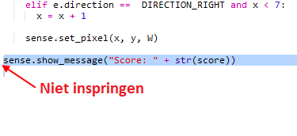

## Score bijhouden

Op dit moment krijg je maar één kans om de schat te vinden. Laten we de speler 10 beurten geven en een score bijhouden.

+ Nu heb je een `for` lus nodig om de speler 10 beurten te geven om de schat te vinden:
    
    

+ In Python moet code ingesprongen zijn om in een lus te zitten. Je hoeft de regels echter niet één voor één in te springen! Markeer alle code na de `for` lus en druk vervolgens op de 'Tab'-toets op het toetsenbord en alles wordt ingesprongen.
    
    
    
    Zorg ervoor dat alle code na de `for` is ingesprongen, helemaal tot onderaan de code.

+ Voeg vervolgens een variabele score toe die begint bij nul:
    
    

+ Je moet er een bij de score optellen wanneer een speler de juiste locatie kiest:
    
    

+ En tot slot, laten we de score aan het einde weergeven.
    
    
    
    Zorg ervoor dat deze code niet ingesprongen is, deze moet worden uitgevoerd nadat de `for` lus 10 keer is uitgevoerd en het spel is afgelopen.
    
    + Speel nu het spel. Kun jij 10 op 10 scoren?