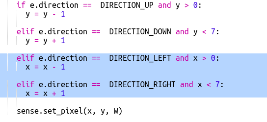

## Finding the treasure

Now let's show the player as a white pixel. You'll need to use the Sense HAT joystick to navigate to where you think the treasure is hidden.

The physical Sense Hat has a mini joystick. You can see a picture of it in the emulator:

In the emulator you can use the arrow keys for the direction buttons on the joystick and Enter (Return) for pressing the middle button.

Now let's add a pixel that the player can move to where they think the treasure is hidden. The player is a white pixel.

+ Now display the player's location using a white pixel:
    
    
    
    `x` and `y` are the player's coordinates.

+ Let's get the white pixel moving using the joystick. Every time the player presses one of the arrow keys on the joystick we need to clear the current pixel and draw one at the new location. Let's start by allowing the player to move in the y direction (up and down):
    
    

+ Test your code by pressing the up and down arrows on the keyboard.
    
    
    
    What happens when you reach the top edge and press up?
    
    
    
    If the y position goes below 0 or above 7 then you'll get an error when you try and set the pixel colour.

+ Let's add a check to make sure the pixel stays on the display:
    
    

+ Now let's add movement in the x direction. Add the highlighted code:
    
    

+ Once you have moved to the location where you think the treasure is hidden you need to press the middle button on the joystick. In the emulator you'll need to press Enter (Return) on the keyboard.
    
    If the player is at the same location as the treasure then they've found it and the pixel goes green for 1 second.
    
    If the player has picked the wrong location then the pixel goes red for 1 second.
    
    
    
    `break` means we don't need to wait for more events after the player has chosen a location, we can stop repeating the loop.